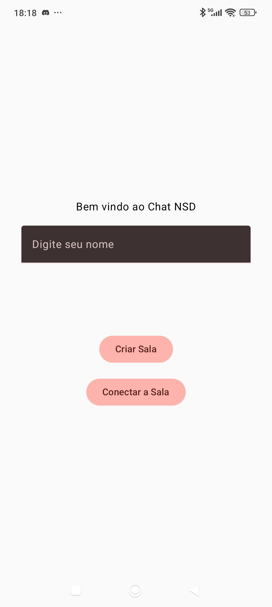
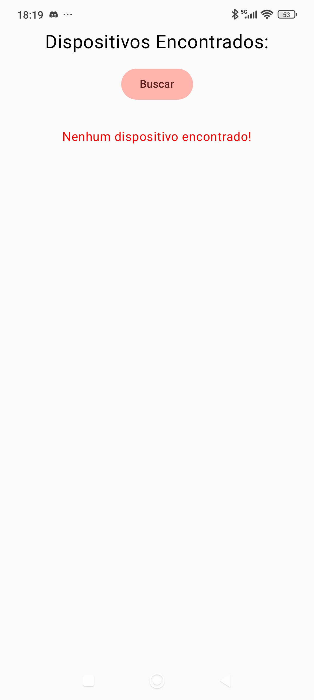
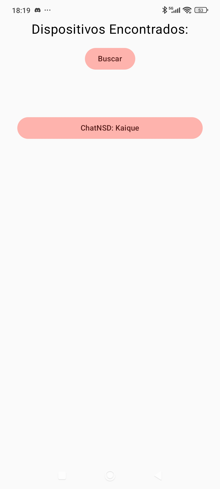
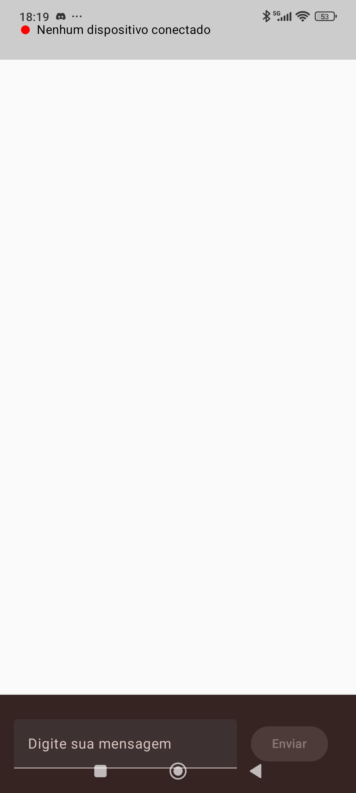
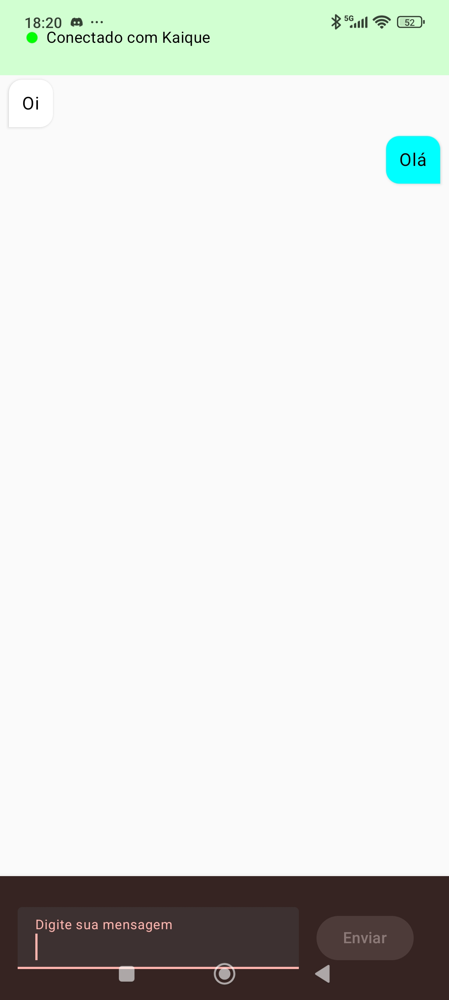

# Chat NSD

Aplicativo Android desenvolvido em Kotlin com Jetpack Compose para comunicação entre dispositivos via rede local.

## Visão Geral
- Um dispositivo atua como servidor e anuncia seu serviço na rede.
- Outros dispositivos atuam como clientes e conectam-se ao servidor encontrado.
- Interface moderna construída com Material 3.

## Funcionalidades
- **Comunicação Cliente-Servidor**: Conexão direta entre dispositivos sem necessidade de um servidor externo.
- **Mensageria em Tempo Real**: Envio e recebimento de mensagens instantâneas.
- **Feedback de Conexão**: Interface reativa que indica o status da conexão e identifica o usuário conectado.

## Pré-visualizações
### Home


### Conectar a um servidor (Sem resposta)


### Conectar a um servidor (Com resposta)


### Tela de Chat (Sem conexão)


### Tela de Chat (Com conexão)


## Stack e Ferramentas
- **Linguagem**: Kotlin 2.0.21
- **UI**: Jetpack Compose
- **Build**: AGP 8.13.2
- **Compatibilidade**: Min SDK 31 | Target SDK 36

> Este projeto foi desenvolvido durante a cadeira de Programação para Dispositivos Móveis (2025.2) do curso de SMD da UFC.

## Codigo

### 1. Register Listener
Objeto usada para verificar o estado do registro do serviço
```kotlin
private val registrationListener = object : NsdManager.RegistrationListener {
    override fun onServiceRegistered(NsdServiceInfo: NsdServiceInfo) {
        Log.d("NSD_LOG", "Serviço registrado com sucesso!")
        Log.d("NSD_LOG", "Nome: ${NsdServiceInfo.serviceName}")
        Log.d("NSD_LOG", "Tipo: ${NsdServiceInfo.serviceType}")
        Log.d("NSD_LOG", "Porta: ${NsdServiceInfo.port}")

    }

    override fun onRegistrationFailed(serviceInfo: NsdServiceInfo, errorCode: Int) {
        Log.e("NSD_LOG", "Falha no registro: $errorCode")
    }

    override fun onServiceUnregistered(arg0: NsdServiceInfo) {}
    override fun onUnregistrationFailed(serviceInfo: NsdServiceInfo, errorCode: Int) {}
}
```

### 2. Service Info
As informações do serviço são definidas aqui.
```kotlin
val serviceInfo = NsdServiceInfo()
serviceInfo.serviceName = "ChatNSD: $nome"
serviceInfo.serviceType = SERVICE_TYPE
serviceInfo.port = serverPort
```

### 3. Init Server
Registro do serviço e iniciação do servidor
```kotlin
fun InitServerSocket(nome: String?) {
    viewModelScope.launch(Dispatchers.IO) {
        try {
            val serverSocket = ServerSocket(0)
            val serverPort: Int = serverSocket.localPort

            val serviceInfo = NsdServiceInfo()
            serviceInfo.serviceName = "ChatNSD: $nome"
            serviceInfo.serviceType = SERVICE_TYPE
            serviceInfo.port = serverPort


            nsdManager.registerService(serviceInfo, NsdManager.PROTOCOL_DNS_SD, registrationListener)

            Log.d("NSD_LOG", "Servidor iniciado na porta $serverPort")

            socket = serverSocket.accept()

            val saida = PrintWriter(socket?.getOutputStream(),true)
            saida.println(nome)

            mensageManager(socket)

        } catch (e: Exception) {
            e.printStackTrace()
        }finally {
            socket?.close()
        }
    }
}
```

### 4. Discovery Listener
Objeto usada para verificar o estado da descoberta do serviço
```kotlin
private val discoveryListener = object : NsdManager.DiscoveryListener {
    override fun onDiscoveryStarted(serviceType: String?) {
        isDiscoveryRunning = true
        Log.d("NSD_LOG", "Busca iniciada")
    }

    override fun onDiscoveryStopped(serviceType: String?) {
        isDiscoveryRunning = false

        Log.i("NSD_LOG", "Busca parada: $serviceType")
    }

    override fun onServiceFound(serviceInfo: NsdServiceInfo?) {
        Log.d("NSD_LOG", "Serviço encontrado: ${serviceInfo?.serviceName}")
        when {
            serviceInfo?.serviceType != SERVICE_TYPE -> return

            serviceInfo.serviceName.contains("ChatNSD") -> devicesFound.add(serviceInfo)
        }
        Log.d("NSD_LOG", "Dispositivos encontrados: ${devicesFound.map{it.serviceName}}")
    }

    override fun onServiceLost(serviceInfo: NsdServiceInfo?) {
        Log.e("NSD_LOG", "Serviço perdido: ${serviceInfo?.serviceName}")
    }

    override fun onStartDiscoveryFailed(serviceType: String?, errorCode: Int) {
        Log.e("NSD_ERROR", "Discovery falhou: $errorCode")
        isDiscoveryRunning = false
    }

    override fun onStopDiscoveryFailed(serviceType: String?, errorCode: Int) {
        Log.e("NSD_LOG", "Falha na parada da busca: $errorCode")
        isDiscoveryRunning = false
    }
}
```

### 5. Discovery Service
Função usada para iniciar a descoberta de serviços
```kotlin
fun discoveryService() {
    devicesFound.clear()
    if (isDiscoveryRunning) {
        try {
            nsdManager.stopServiceDiscovery(discoveryListener)
        } catch (e: Exception) {
            Log.d("NSD_LOG", "Erro ao parar busca anterior (ignorado): ${e.message}")
        }
        isDiscoveryRunning = false
    }

    try {
        nsdManager.discoverServices(SERVICE_TYPE, NsdManager.PROTOCOL_DNS_SD, discoveryListener)
        isDiscoveryRunning = true
    } catch (e: Exception) {
        Log.e("NSD_LOG", "Falha ao iniciar descoberta: ${e.message}")
        isDiscoveryRunning = false
    }
}
```
### 5. Connect Device
Função usada para resolver o serviço e conectar no server
```kotlin
fun connectDevice(serviceInfo: NsdServiceInfo, name: String?) {
        val resolveListener = object : NsdManager.ResolveListener {
            override fun onResolveFailed(serviceInfo: NsdServiceInfo?, errorCode: Int) {
                Log.e("NSD_LOG", "Falha no resolve: $errorCode")
            }

            override fun onServiceResolved(serviceInfo: NsdServiceInfo) {
                viewModelScope.launch(Dispatchers.IO) {
                    try {
                        Log.d("NSD_LOG", "Serviço resolvido: ${serviceInfo.serviceName}")

                        val host = serviceInfo.host
                        val port: Int = serviceInfo.port

                        socket = Socket(host, port)
                        val saida = PrintWriter(socket?.getOutputStream(),true)

                        saida.println(name)

                        Log.d("NSD_LOG", "Conexão estabelecida com ${serviceInfo.serviceName}, Port: $port, Host: $host")

                        mensageManager(socket)
                    } catch (e: Exception) {
                        e.printStackTrace()
                    }
                }
            }
        }
        nsdManager.resolveService(serviceInfo, resolveListener)
    }
```
### 5. Mensage Manager e Send Message
Funções para o tratamento de mensagens (Estuta e envio)
```kotlin
suspend fun mensageManager(socket: Socket?){
    withContext(Dispatchers.IO){
        try {
            val entrada = BufferedReader(InputStreamReader(socket?.getInputStream()))

            while (socket?.isConnected == true && !socket.isClosed){
                val readLine = entrada.readLine() ?: break
                Log.d("NSD_LOG", "Mensagem recebida: $readLine")
                if(firstMensage){
                    firstMensage = false
                    withContext(Dispatchers.Main){
                        clientName = readLine
                    }

                }else{
                    withContext(Dispatchers.Main){
                        messageList.add(Message(readLine,false))
                    }
                }
            }
        }catch (e: Exception){
            e.printStackTrace()
        }

    }
}

fun sendMessage(message: String) {
    viewModelScope.launch(Dispatchers.IO) {
        try {
            val sendMessage = PrintWriter(socket?.outputStream, true)
            sendMessage.println(message)

            withContext(Dispatchers.Main) {
                messageList.add(Message(message, true))
            }
        } catch (e: Exception) {
            e.printStackTrace()
        }
    }
}
```